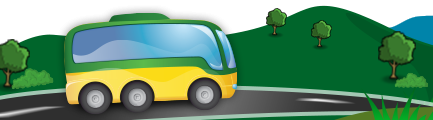

<h1 align="center">
  Desafio BuscaOnibus
</h1>

 Status <☕> 19 abril 2022 <☕/>

# 
### Descrição
Para esse desafio foi proposto a alteração do arquivo “old-school.html” usando as melhores práticas de HTML5 e adaptação para uma interface responsiva.
## 📁 Acessibilidade :
- Para ler os códigos basta acessá-los diretamente nesse repositório.     

- Para testar a responsividade da page, clique na imagem abaixo com o *scroll* ou com o botão direito do mouse para abrir em nova aba:

## :hammer_and_wrench: Tecnologias Utilizadas :
# HTML5 | CSS3 | Bootstrap
## :octocat: Candidata : 
<table>
  <tr>
    <td align="center">
      <a href="#">
         
        
          <b>Debh Valois</b>
        
      </a>
    </td>
  </tr>
</table>

